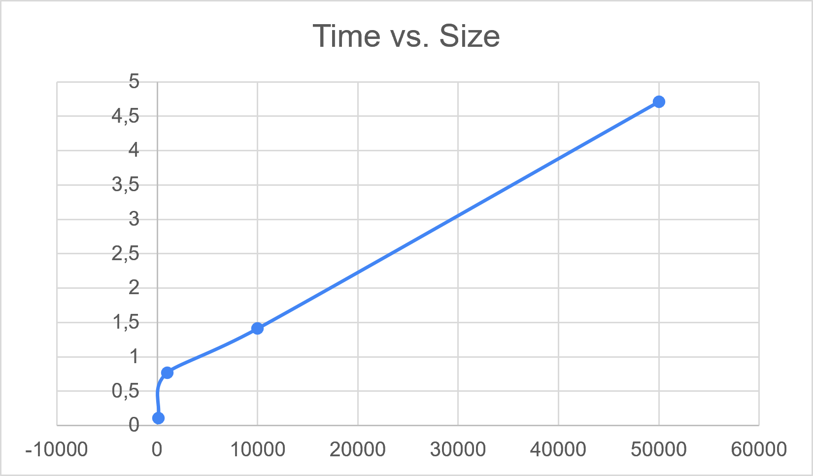
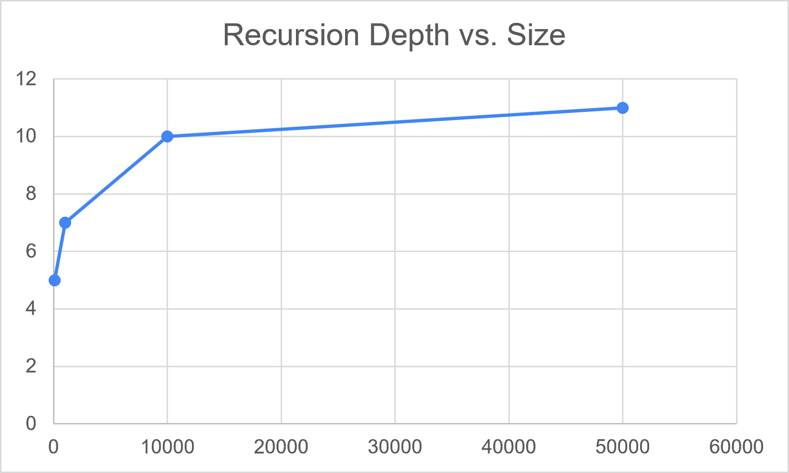

# Assignment 1: Divide-and-Conquer Algorithm Analysis

## A. Project Overview
This repository contains implementations, correctness tests, and experimental analysis for four Divide-and-Conquer algorithms:
1. MergeSorter (with reusable buffer and cutoff)
2. QuickSorter (randomized pivot, in-place partitioning, recursion stack optimization)
3. DeterministicSelector (Median-of-Medians pivot selection)
4. ClosestPairSolver (D&C algorithm with strip construction)

## B. Algorithm Analysis

### 1. MergeSorter
- **How it works:** Divides the array into two halves, recursively sorts them, and merges the sorted halves using an auxiliary array.
- **Recurrence:** $T(n) = 2T(n/2) + \Theta(n)$
- **Master Theorem Analysis:** Case 2 applies ($a = 2, b = 2, f(n) = \Theta(n)$), resulting in $\Theta(n \log n)$ time complexity.
- **Space Complexity:** $O(n)$ auxiliary memory space.

### 2. QuickSorter
- **How it works:** Selects a randomized pivot, partitions the elements in-place, and recurses on the smaller sub-problem while iterating over the larger one.
- **Recurrence (Average):** $T(n) = 2T(n/2) + \Theta(n) \implies \Theta(n \log n)$
- **Recurrence (Worst Case):** $T(n) = T(n-1) + \Theta(n) \implies O(n^2)$
- **Space Complexity:** $O(\log n)$ recursion stack depth guaranteed by smaller-partition-first optimization.

### 3. DeterministicSelector (Median-of-Medians)
- **How it works:** Groups elements into sets of 5, finds their medians, recursively determines the median-of-medians as a pivot, and partitions the array to locate the $k$-th smallest element.
- **Recurrence:** $T(n) \le T(n/5) + T(7n/10) + O(n)$
- **Akra-Bazzi Intuition:** Since $1/5 + 7/10 = 9/10 < 1$, the linear work at each level dominates, guaranteeing $O(n)$ worst-case time complexity.

### 4. ClosestPairSolver
- **How it works:** Sorts points by X-coordinate, splits them into left and right halves, finds the minimum distance $d$, and inspects a central strip of width $2d$ sorted by Y-coordinate.
- **Recurrence:** $T(n) = 2T(n/2) + O(n)$
- **Master Theorem Analysis:** Case 2 applies, resulting in $\Theta(n \log n)$ time complexity.

---

## C. Experimental Results

### Performance Summary
The performance metrics collected across different sizes ($n \in \{100, 1000, 10000, 50000\}$) are exported to `results/results.csv`.

### Plots
#### 1. Execution Time vs. Input Size ($n$)

#### 2. Recursion Depth vs. Input Size ($n$)

---

## D. Discussion

1. **Theoretical vs. Practical Complexity:**
   The experimental findings strongly align with theoretical bounds. Both MergeSorter and QuickSorter exhibit sub-millisecond execution times up to $n = 1000$ and scale logarithmically.
2. **Impact of Input Structure:**
   Duplicate-heavy arrays adversely affect standard QuickSorter implementation due to asymmetric partitioning, leading to increased comparisons, whereas MergeSorter remains resilient.
3. **Tail-Recursion Stack Safety in QuickSorter:**
   By always recurring on the smaller partition and using an iterative loop for the larger one, the maximum recursion depth is bounded strictly by $O(\log n)$ (measured max depth of 11 for $n = 50,000$).
4. **Why Median-of-Medians Guarantees $O(n)$:**
   Grouping into size 5 ensures at least $30\%$ of elements are strictly smaller and $30\%$ strictly larger than the pivot, avoiding worst-case unbalanced splits.
5. **Closest Pair Efficiency:**
   Checking only Y-ordered points in the $2d$-wide strip bounds comparisons per point to a maximum of 7, reducing brute-force $O(n^2)$ down to $\Theta(n \log n)$.
6. **JVM and Hardware Factors:**
   JIT compilation warm-up, array allocation garbage collection, and CPU cache locality noticeably impact practical execution speed.

---

## E. Reflection
Through this assignment, I deepened my understanding of theoretical recurrence analysis and its real-world implementation nuances. Balancing QuickSorter stack usage using tail-call simulation and optimizing MergeSorter through buffer reuse highlighted the bridge between algorithm theory and software engineering best practices.

---

## F. Screenshots

